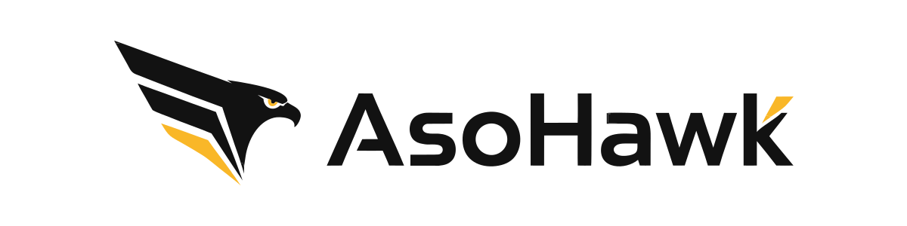
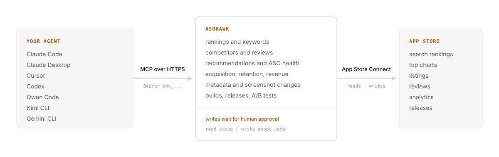

<picture>
  <source media="(prefers-color-scheme: dark)" srcset="assets/banner-dark.svg">
  
</picture>

<p align="center"><strong>App Store Optimization, built for AI agents.</strong></p>

<p align="center">
  <a href="https://asohawk.cc"></a>
  <a href="https://registry.modelcontextprotocol.io"></a>
  <a href="TOOLS.md"></a>
</p>

ASOHawk is an ASO platform your AI agent uses directly. It speaks [MCP](https://modelcontextprotocol.io), the protocol Claude Code, Claude Desktop, Cursor, Codex and most agent CLIs already understand. Point an agent at it once and it reads your App Store rankings, keywords, competitors, reviews and revenue, and manages tracking and metadata on request.

The web dashboard exists too, but the agent is a first-class citizen, not an afterthought: every capability is a versioned tool with an explicit contract, honest limitations, and a safety model where anything that touches your App Store listing waits for your approval.

## How it works

<picture>
  <source media="(prefers-color-scheme: dark)" srcset="assets/how-it-works-dark.svg">
  
</picture>

The server is remote MCP over HTTPS. Nothing to install, nothing to run, no local database: one config block in your client and the agent is connected.

## Quick start

**1. Create a key.** Sign up at [asohawk.cc](https://asohawk.cc) (free plan, no credit card), then open **Settings → API keys** and create a key. Read by default; add write to let the agent manage tracking.

**2. Connect.** For Claude Code, run once in any terminal:

```sh
claude mcp add --transport http --scope user asohawk https://asohawk.cc/api/mcp --header "Authorization: Bearer ahk_YOUR_KEY"
```

<details>
<summary><strong>Claude Desktop</strong></summary>

**Settings → Developer → Edit Config**, then add:

```json
{
  "mcpServers": {
    "asohawk": {
      "type": "http",
      "url": "https://asohawk.cc/api/mcp",
      "headers": {
        "Authorization": "Bearer ahk_YOUR_KEY"
      }
    }
  }
}
```

</details>

<details>
<summary><strong>Cursor</strong></summary>

Save as `.cursor/mcp.json` in your project, or `~/.cursor/mcp.json` to make it available everywhere:

```json
{
  "mcpServers": {
    "asohawk": {
      "url": "https://asohawk.cc/api/mcp",
      "headers": {
        "Authorization": "Bearer ahk_YOUR_KEY"
      }
    }
  }
}
```

</details>

<details>
<summary><strong>Codex</strong></summary>

Add to `~/.codex/config.toml`:

```toml
[mcp_servers.asohawk]
url = "https://asohawk.cc/api/mcp"

[mcp_servers.asohawk.http_headers]
Authorization = "Bearer ahk_YOUR_KEY"
```

To keep the key out of the file, use `codex mcp add` with `--bearer-token-env-var ASOHAWK_API_KEY` instead.

</details>

<details>
<summary><strong>Qwen Code</strong></summary>

Add to `~/.qwen/settings.json`:

```json
{
  "mcpServers": {
    "asohawk": {
      "httpUrl": "https://asohawk.cc/api/mcp",
      "headers": {
        "Authorization": "Bearer ahk_YOUR_KEY"
      }
    }
  }
}
```

</details>

<details>
<summary><strong>Kimi CLI</strong></summary>

```sh
kimi mcp add --transport http asohawk https://asohawk.cc/api/mcp --header "Authorization: Bearer ahk_YOUR_KEY"
```

</details>

<details>
<summary><strong>Gemini CLI, VS Code and any other MCP client</strong></summary>

Gemini CLI takes the same `httpUrl` block as Qwen Code in `~/.gemini/settings.json`. VS Code takes a `servers` block in `.vscode/mcp.json`. Any client that reads `mcp.json` works with the standard shape:

```json
{
  "mcpServers": {
    "asohawk": {
      "type": "http",
      "url": "https://asohawk.cc/api/mcp",
      "headers": {
        "Authorization": "Bearer ahk_YOUR_KEY"
      }
    }
  }
}
```

Exact snippets for every client, plus a stdio bridge for clients without remote MCP support, are in the [getting started guide](docs/getting-started.md).

</details>

**3. Ask.** The agent calls ASOHawk and answers in plain language:

> Give me a growth report for my apps this week.

> Who are my top competitors and which keywords do they rank for that I don't?

> Find new keyword opportunities for my app and track the best ones.

> How many downloads and how much revenue does https://apps.apple.com/us/app/duolingo/id570060128 get?

## What the agent can do

64 tools cover the full ASO loop: rankings and keyword tracking, competitor discovery and monitoring, review streams, ASO health and recommendations, acquisition and retention funnels, revenue, keyword difficulty and popularity scoring, exact Apple Search Ads popularity on demand, chart moves, hypotheses and learnings, App Store Connect metadata edits, screenshot changes, native A/B tests (Product Page Optimization), IAP and subscription repricing, build attachment and App Review submission.

Every tool returns the same envelope: the answer under `data`, plus `data_freshness`, honest `limitations`, `recommended_next_capabilities` and a `cost_class`. Agents do not guess what a number means or what to call next; the response says so.

- **[Tool reference](TOOLS.md)**: every tool with its contract, generated from the live registry.
- **[Playbooks](docs/playbooks.md)**: 15 step-by-step recipes, from onboarding an app to shipping a build through App Review.
- **[Concepts](docs/concepts.md)**: authentication, permissions, the response envelope, errors, cost classes.

## Built for trust

- **Scoped keys.** Read keys see read tools only; write tools are invisible to them, not just refused.
- **Human approval on writes.** Metadata changes, screenshot changes, price changes and App Review submissions are proposals first. A human approves them in the dashboard before anything reaches App Store Connect. High-risk operations (name or description rewrites, prices, review submissions) wait for a human even in workspaces that enable auto-apply.
- **Per-domain read controls.** Each data domain can be switched off for agents independently.
- **A closed error contract.** Refusals carry a reason code, whether a retry can succeed, and alternative tools; agents recover instead of hallucinating.

Details in [concepts](docs/concepts.md).

## Links

- Website and signup: [asohawk.cc](https://asohawk.cc)
- Live agent guide with your real key filled in: [asohawk.cc/docs/agent](https://asohawk.cc/docs/agent)
- Pricing: [asohawk.cc/#pricing](https://asohawk.cc/#pricing)

ASOHawk is a hosted service; this repository is its public documentation. Found a gap or want a tool that is missing? [Open an issue](https://github.com/prodocik/asohawk/issues).
